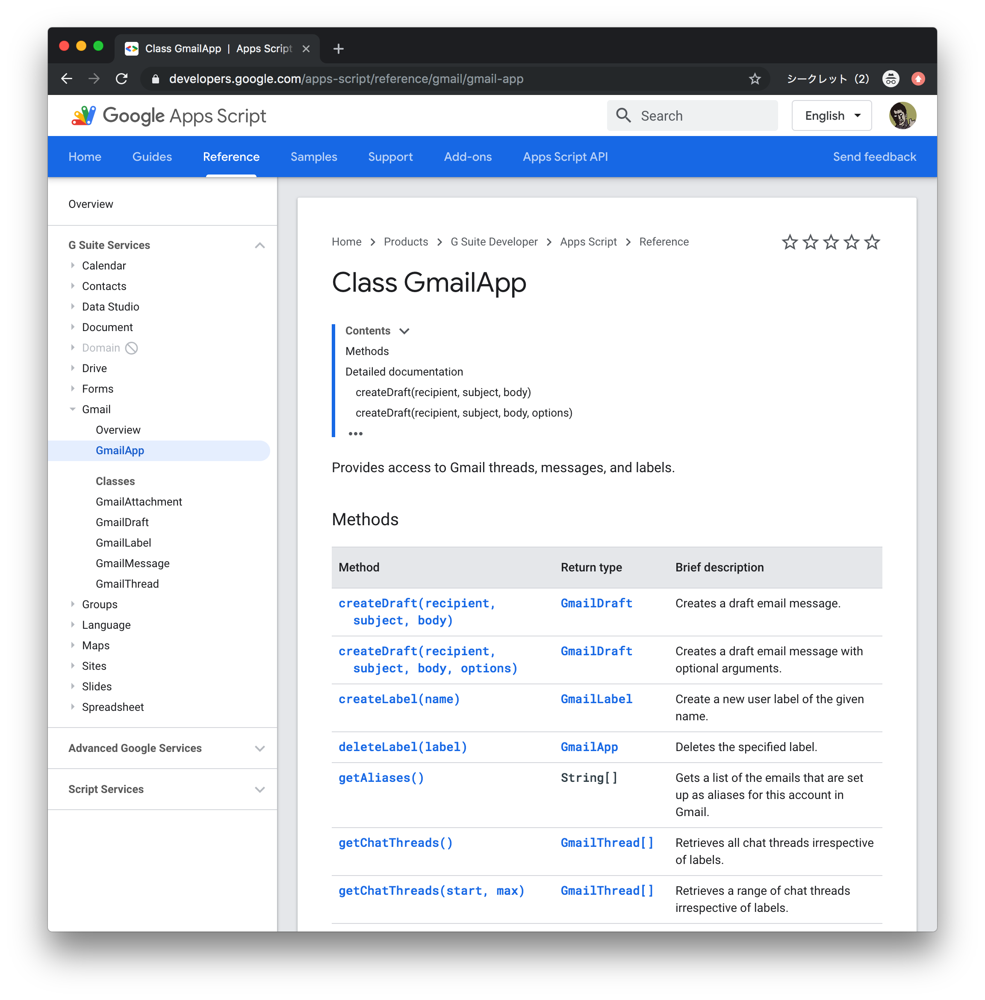
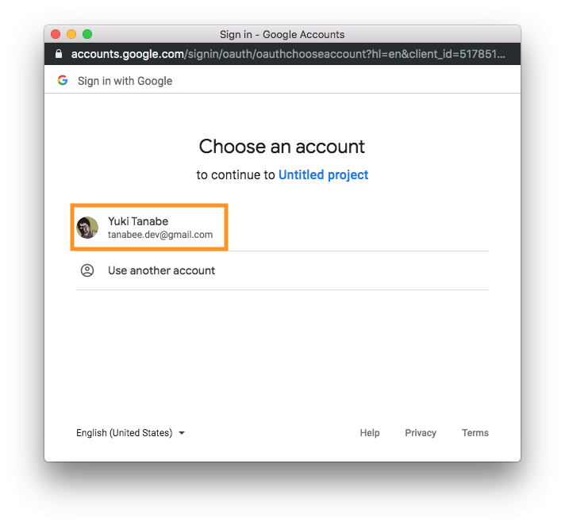
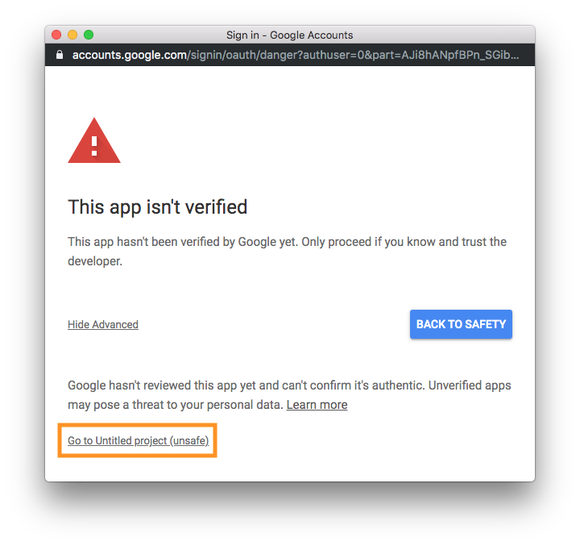
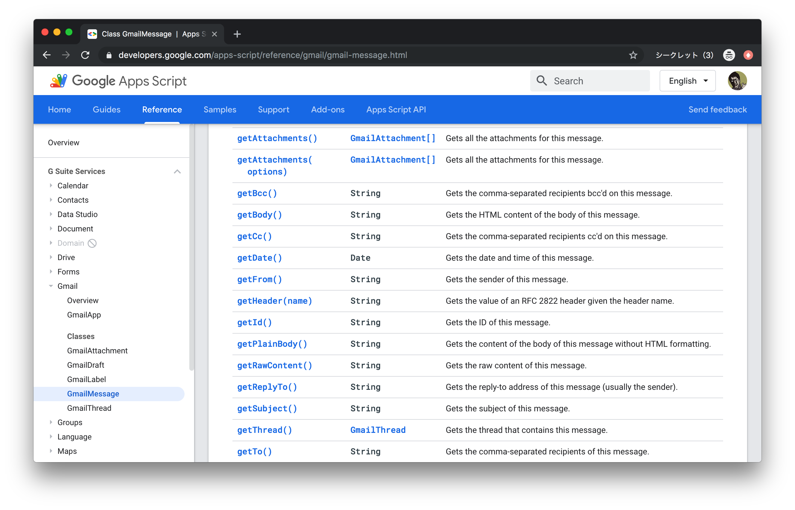

author: Yuki Tanabe
summary: Apps Script Hands-on
id: en
categories: apps-script,gsuite,javascript
environments: Web
status: Draft
analytics account: UA-141719032-2
feedback link: https://github.com/tanabee/gas-codelab/issues

# Apps Script Hands-on

## Intro

In this codelab, you can make a application that exports Gmail messages to Google Spreadsheet.


### Target

- Beginner of Apps Script
- Have experience of JavaScript

### Usecase

// TODO

## Preparation

You need own Gmail or G Suite account. Please create Gmail account if you don't have.

Negative
: If you use Gmail for the first time, you need to follow below

### 1. Open mail-to-me application

Open the application in your browser.
[mail-to-me](https://script.google.com/d/1p2B0NwXg3APMc-nh-fRWuMX6P_W5eQijsi4CVEHLOOq7_zJmQbWyZAWl/edit?usp=sharing)

### 2. Make a copy

Select **File** > **Make a Copy**.

### 3. Run mail-to-me

Select **Run** button.

### 4. Confirm your Gmail

Open [Gmail](https://mail.google.com) in your browser and confirm to receiv emails.

## Create project

Let's create a Apps Script project. First, visit [drive.google.com](https://drive.google.com) and create a Spreadsheet file.


Click **New**


Click **Google Sheets** and Spreadsheet file will be created.


Click project name area, and input project name. (e.g. gmail-to-spreadsheet)


Select **Tools** > **Script editor** menu, and Google Apps Script file will be created.


Click project name area, and input project name. (e.g. gmail-to-spreadsheet)


After inputting project name, Click OK and it will be saved. Then a toast appears. the project will be saved when the toast disappears.

Now, we can run the script! We will run the script in the next section.

## Run script

Copy the script below and paste to the Script editor, and click **Run** button.

```JavaScript
function main() {
  Logger.log('Hello Google Apps Script!');
}
```


`Logger.log()` is logging function in Google Apps Script.


You can view logs when you select **View** > **Logs** in the menu.


We can find the text `Hello Google Apps Script!` in Log Viewer.

We can alse use `console.log()`, but we use `Logger.log()` in this Hands-on because you need additional process to use `console.log()`. 

## GmailApp class

Next, let's understand GmailApp class. Confirm GmailApp classes and methods in [official reference](https://developers.google.com/apps-script/reference/). See [GmailApp document](https://developers.google.com/apps-script/reference/gmail/gmail-app). You can see GmailApp classes (e.g. [GmailMessage](https://developers.google.com/apps-script/reference/gmail/gmail-message), [GmailThread](https://developers.google.com/apps-script/reference/gmail/gmail-thread) ) and methods (e.g. [search](https://developers.google.com/apps-script/reference/gmail/gmail-app#searchquery,-start,-max), [sendEmail](https://developers.google.com/apps-script/reference/gmail/gmail-app#sendemailrecipient,-subject,-body,-options)) 



We use [search](https://developers.google.com/apps-script/reference/gmail/gmail-app#searchquery,-start,-max) method for retrieving emails in this time.

## Retrieve Gmail threads

Let's implement the script. Use `GmailApp.search` method and retrieve Gmail threads.

```JavaScript
function main() {
  var searchText = '';// You can set value.
  var threads = GmailApp.search(searchText, 0, 5);
  Logger.log(threads);
}
```

If you would like to apply search filter, you can assign value to searchText. You can confirm search operators [here](https://support.google.com/mail/answer/7190?hl=en). Click **Run** button.


Then authentication popup will be shown. You need to allow this project to access Gmail resources. Click **Review Permissions**.


Choose a account that you are using in this codelab.



To verify this app, click **Advanced** and click bottom link **Go to ...**. If it doesn't be displayed, skip this step.


Then the scope you need to allow is displayed. Click **Allow** button. it will go back to Script editor and run the script.


See the logs. Then you can see Array of GmailThread. You succeeded to retrieve emails for only 5 rows code! Because of this popup authentication flow, you don't need to implement authentication codes and you can make it easy.

## Parse Gmail messages

In the previous section, we could retrieve Gmail threads. We'd like message subject, body, from, to, date in this time. So, we need to get messages from `GmailThread`.


Visit Apps Script reference. GmailThread class has [getMessages()](https://developers.google.com/apps-script/reference/gmail/gmail-thread#getmessages) method and it returns Array of GmailMessage. Click **GmailMessagge** link and see the methods.


it has getSubject, getBody, getFrom, getTo, getDate and many retrieving methods. We can get values we want using `GmailThread.getMessages()`.

In this time, we use the first message of the threads. Retrieve message and show logs.

```JavaScript
function main() {
  var searchText = '';
  var threads = GmailApp.search(searchText, 0, 5);
  threads.forEach(function (thread) {
    var message = thread.getMessages()[0];
    Logger.log(message);
  });
}
```


You can see the text **GmailMessage** in log viewer.

Finaly, get values to call methods.

```JavaScript
function main() {
  var searchText = '';
  var threads = GmailApp.search(searchText, 0, 5);
  threads.forEach(function (thread) {
    var message = thread.getMessages()[0];
    Logger.log(message.getSubject());
    Logger.log(message.getFrom());
    Logger.log(message.getTo());
    Logger.log(message.getPlainBody());
    Logger.log(message.getDate());
  });
}
```


Run the script and See the logs. You succeeded to retrieve Gmail message values! From Next section, we will insert these values to Spreadsheet.

## SpreadsheetApp class

// TODO: Graph: Spreadsheet > Sheet > Range 

Next, let's understand SpreadsheetApp class. Visit [SpreadsheetApp reference](https://developers.google.com/apps-script/reference/spreadsheet/spreadsheet-app) and see [getActiveSheet](https://developers.google.com/apps-script/reference/spreadsheet/spreadsheet-app#getactivesheet) method section. You can access the Spreadsheet you created to use this method.

Run this method below. You need to allow the authentication just like in Gmail.

```JavaScript
function insertMessages() {
  Logger.log(SpreadsheetApp.getActiveSheet().getName());
}
```


You can see the Spreadsheet tab name in the log viewer. You need to access [Range](https://developers.google.com/apps-script/reference/spreadsheet/range) class to insert data into the sheet. Use [Range.setValues()](https://developers.google.com/apps-script/reference/spreadsheet/range#setvaluesvalues) to insert messages.

```JavaScript
function insertMessages() {
  var data = [
    ['a', 'b', 'c'],
    ['d', 'e', 'f'],
  ];
  SpreadsheetApp
    .getActiveSheet()
    .getRange("A1:C2")
    .setValues(data);
}
```


Run this method and See the Spreadsheet. You can see the value is inserted into the sheet. Note that the argument must be a two-dimensional array.

## Save emails to Spreadsheet

```JavaScript
function main() {
  var searchText = '';
  var threads = GmailApp.search(searchText, 0, 5);
  var messages = [];
  threads.forEach(function (thread) {
    var message = thread.getMessages()[0];
    if (message.getPlainBody().length > 10000) {
      return;
    }
    messages.push([
      message.getSubject(),
      message.getFrom(),
      message.getTo(),
      message.getPlainBody(),
      message.getDate(),
    ]);
  });
  insertSpreadSheet(messages);
}

function insertSpreadSheet(data) {
  SpreadsheetApp
    .getActiveSheet()
    .getRange("A1:E" + data.length)
    .setValues(data);
}
```

## Spreadsheet Custom Menu

```JavaScript
function onOpen() {
  SpreadsheetApp
    .getActiveSpreadsheet()
    .addMenu('Gmail', [
      {name: 'Fetch', functionName: 'main'},
    ]);
}
```

```JavaScript
function onOpen() {
  SpreadsheetApp
    .getActiveSpreadsheet()
    .addMenu('Gmail', [
      {name: 'Fetch', functionName: 'main'},
      {name: 'Clear sheet', functionName: 'clearSheet'},
    ]);
}

function clearSheet() {
  SpreadsheetApp
    .getActiveSheet()
    .clear();
}
```

## Congrats

```JavaScript
function onOpen() {
  SpreadsheetApp
    .getActiveSpreadsheet()
    .addMenu('Gmail', [
      {name: 'Fetch', functionName: 'main'},
      {name: 'Clear sheet', functionName: 'clearSheet'},
    ]);
}

function main() {
  var searchText = '';
  var threads = GmailApp.search(searchText, 0, 5);
  var messages = [['Subject', 'From', 'To', 'Body', 'Date']];
  threads.forEach(function (thread) {
    var message = thread.getMessages()[0];
    if (message.getPlainBody().length > 10000) {
      return;
    }
    messages.push([
      message.getSubject(),
      message.getFrom(),
      message.getTo(),
      message.getPlainBody(),
      message.getDate(),
    ]);
  });
  insertSpreadSheet(messages);
}

function insertSpreadSheet(data) {
	clearSheet();
  SpreadsheetApp
    .getActiveSheet()
    .getRange("A1:E" + data.length)
    .setValues(data);
}

function clearSheet() {
  SpreadsheetApp
    .getActiveSheet()
    .clear();
}
```
